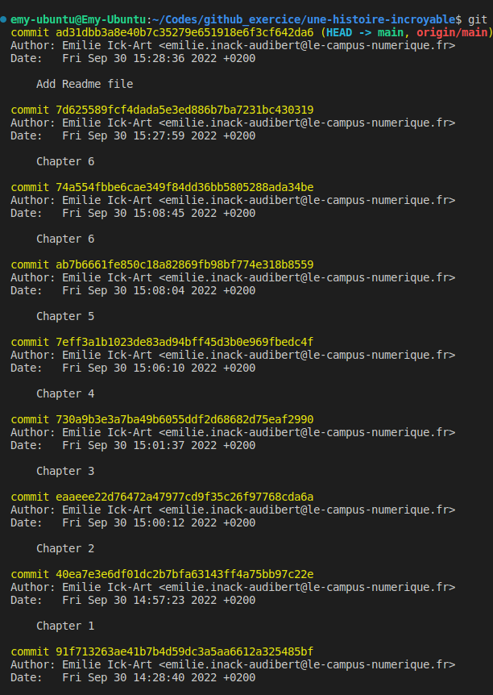

# How to add an image on a markdown file

There is two ways to add an image :
- inline-style
- reférence-style

## Inline-style: 

## Reference-style: 
![alt text][print écran de la commande git log]

[print écran de la commande git log]: git_log.png "Preuve de travail en image"